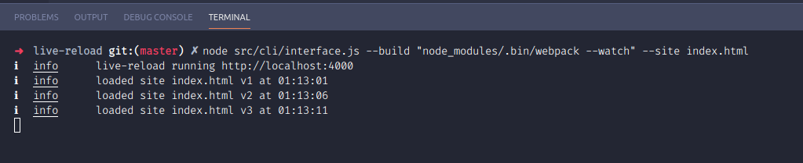

# live-reload

`live-reload` runs an arbitrary build process (e.g `webpack --watch`) and automatically reloads a website on localhost whenever files change. This helps bypass the completely frustrating process of setting up live-website reloading.

- Triggers the site to reload on change via a websocket connection
- Detects and disables service-workers, clears application-caches



## Usage

```
Usage:
live-reload --package

Author:
  Róisín Grannell

Description:
  live-reload is a build-frameworld agnostic method of live-reloading a website when changes are made. It reads configuration from the project's "package.json" or an alternative location and launches a static and API server.
  
  live-reload inserts a websocket listener into the provided html page, so as to communicate file-changes detected with it. When a relevant file-change is detected, the site reloads.

Configuration:
  live-reload expects the "live-reload" property in the project's "package.json".

  {
    "live-reload": ...
  }

  live-reload.build             an array of persistant build commands to launch (e.g ["webpack --watch"]). live-reload will relaunch the static-file & api server if these builds update watched files. If this option is ommited, the static-file & api-servers simply relaunch when you type changes into watched file.

  live-reload.site              contains configuration describing how to launch and manage a static-file server for launching your site.

  live-reload.site.path         the path to your site (e.g public/index.html).

  live-reload.site.publicDir    a public directory to serve files from (e.g public, client). This folder typically includes html, css, and js subdirectories.

  live-reload.site.watch       an array of directories to watch for changes. If files within these directories change, the static-site will reload.

  live-reload.site.port         what port should the static-server run on?

  live-reload.api              contains configuration describing how to launch and manage an api server for launching
  live-reload.api.path         the path to the API server. Expected to be a .mjs module that exports a non-listening express-server.

  live-reload.api.watch        an array of directories to watch for changes. If files within these directories change, the API server will reload.

  live-reload.api.port         what port should the API server run on?
  live-reload.api.env          an object containing environmental variable configuration.
  live-reload.api.env.path     a path to a .env file to load. These variables will be visible to the API server.
```
